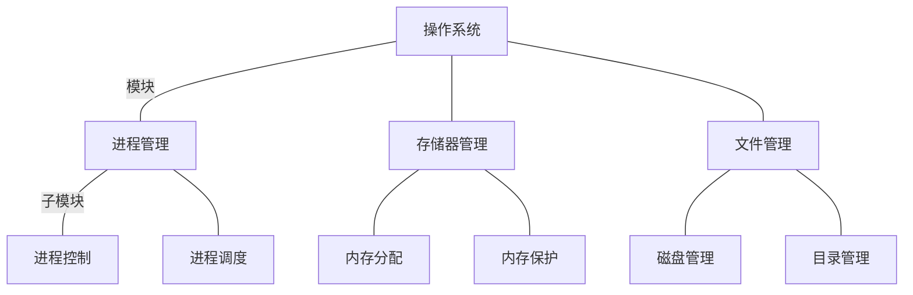

+++
title = "操作系统笔记01"
tags = [ 408, "操作系统",]
categories = [ "考研",]
date = "2024-07-02T23:22:47+08:00"
+++
# 操作系统的概念、功能、目标

作为用户和计算机硬件之间的接口

- 提供的功能：

  - 命令接口：
    - 联机命令接口(输入一次，输出一次)
    - 脱机命令接口(批处理命令)
  - 程序接口：
    - 提供系统调用(广义指令)

- 目标： 方便用户使用

## 关于库函数和系统调用的区别

- 库函数是语言或应用程序的一部分，可以运行在运行在用户空间中
- 系统调用是操作系统的一部分，是内核为用户提供的程序接口，运行在内核空间中，并且许多库函数都是用系统调用来实现功能

### 注意

未使用系统调用的库函数，其执行效率通常要比系统调用的高。因为使用系统调用时，需要上下文的切换及状态转换(由用户态转向核心态)

# 操作系统的特征

## 并发和并行

并发: 是指两个或多个时间在统一时间间隔发生(宏观同时发生，微观交替发生)

并行: 是指在同一时刻能同时完成两种或两种以上的工作

## 互斥和共享

互斥: 在一段时间内只允许一个进程访问资源(例如写入操作)

共享: 在一段时间内允许多个进程访问资源(例如读取操作)

## 虚拟

是指将一个物理上的实体变为若干逻辑上的对应物(例如虚拟机)

## 异步

在多道程序环境下，允许多个程序并发执行，但由于资源有限，进程的执行不是一贯到底的，而是走走停停的，以不可预知的速度向前推进。只有系统拥有并发性，才有可能导致异步性。(例如C++的`async`，开辟一个一次性的线程执行并行任务，主线程可以通过`future`在合适的时机执行等待汇总结果。)

# 操作系统的发展与分类

## 手工操作阶段

- 纸带机(用户独占全机，人机速度矛盾)

## 批处理阶段

- 单道批处理阶段(外围及--磁带)
- 多道批处理系统(操作系统开始出现)

## 分时操作系统

- 轮流处理作业
- 不能处理紧急任务

## 实时操作系统

- 优先处理紧急任务
- 硬实时系统: 必须在严格的时间内完成处理
- 软实时系统: 可以偶尔犯错

## 网络操作系统

## 分布式操作系统

## 个人计算机操作系统

# 操作系统的运行环境

## 处理器运行模式

- 内核态/核心态/管态
- 用户态/目态

## 程序的运行原理:

- 高级语言编写代码-->机器指令
- 程序运行的过程就是CPU执行指令的效果

## 两类程序

- 内核程序
- 应用程序

## 两类指令

- 特权指令: 是指用户不允许直接使用的指令

  - I/O指令
  - 关中断指令
  - 内存清零指令
  - 存取用于内存保护的级存器
  - 送PSW到程序状态字寄存器的指令

- 非特权指令: 是指允许用户直接使用的指令
  - 无法直接访问系统中的软硬资源
  - 仅限于用户的地址空间

## 内核(kernel)

- 内核是操作系统最重要最核心的部分
- 有很多内核程序组成操作系统内核

## 如何改变状态

- 内核态->用户态: 一条修改PSW的特权指令
- 用户态->内核态: 由中断引起，硬件自动完成

## 中断和异常的概念

### 中断

- 定义: 是指来自CPU执行指令外部的时间，通常用于信息输入/输出。

  - 时钟中断
  - I/O中断请求

- 分类:
  - 可屏蔽中断: 通过INTR线发出的中断请求，通过改变屏蔽字可以实现多重中断
  - 不可屏蔽中断: 通过NMI线发出的中断请求，通常是紧急的硬件故障

### 异常

- 定义: 是指来自CPU执行指令内部的时间，例如程序的非法操作码、地址越界、运算溢出、虚存系统的缺页及专门的陷入指令等引起的事件

- 分类:
  - 故障: 由指令执行引起的异常 (软件中断)
  - 自陷: 是一种事先安排的“异常”事件，用于在用户态下调用操作系统内核程序 (软件中断)
  - 终止: 出现了使得CPU无法继续执行的硬件故障 (硬件中断)

### 中断机制的基本实现原理

- 检查中断信号
  - 内中断: CPU在执行指令时会检查是否会有异常发生
  - 外中断: 每个指令周期末尾，CPU都会检查是否由外中断信号需要处理
- 找到相应的中断处理程序
  - 通过“中断向量表”实现

# 系统调用

凡是与资源有关的操作，都必须通过系统调用方式向操作系统提出服务请求，并有操作系统代为完成

- 设备管理: 完成设备的请求或释放，以及设备的启动等功能
- 文件管理: 完成文件的读、写、创建、删除等功能
- 进程控制: 完成进程的创建、撤销、阻塞、唤醒等功能
- 进程通信: 完成进程之间的消息传递或信号传递
- 内存管理: 完成内存分配、回收及获取作业占用内存区大小和起始地址等功能

## 系统调用的过程

- 传参
- 陷入指令/Trap/访管
- 由操作系统内核程序处理系统调用请求
- 返回应用程序

# 操作系统的运行机制和体系结构

## 分层结构

内核分多层，每层可以单项调用更低一层提供的接口

### 优点:

- `便于系统的调试和验证，自底向上逐层调试验证，简化了系统设计和实现`
- 易扩充和易维护，各层之间调用接口清晰固定

### 缺点:

- 合理定义各层关系比较困难，仅可调用相邻底层，难以合理定义各层的边界
- `效率较差，不可跨层调用，系统调用执行时间长`

## 模块化

将内核划分为多个模块，各模块之间相互协作

内核 = 主模块+可加载内核模块

`主模块: 只负责核心功能，如进程调度、内存管理`  
可加载内核模块: 可以动态加载新模块到内核，而无需重新编译整个内核

### 优点:

- 模块间逻辑清晰易于维护，确定模块间接口后即可多模块同时开发
- `支持动态加载新的内核模块(安装设备驱动、安装新的文件系统模块到内核)，增强OS的适应性`
- `任何模块都可以直接调用其他模块，无需采用消息传递进行通信，效率高`

### 缺点:

- 模块间的接口定义未必合理、使用
- 模块间相互以来，更难调试和验证

## 宏内核

所有的系统功能都放在内核里（大内核结构的OS通常也采用了“模块的”的设计思想）

### 优点:

- 性能高，内核内部各种功能都可以直接相互调用

### 缺点:

- 内核庞大功能复杂，难以维护
- 大内核中某个功能模块出错，就可能导致整个系统崩溃

## 微内核

只把中断、原语、进程通信等最核心的功能放入内核。进程管理、文件管理、设备管理等功能以用户进程的形式运行在用户态

### 优点:

- 内核小功能少、易于维护，内核可靠性高
- 内核外的某个功能模块出错不会导致整个系统的崩溃

### 缺点:

- 性能低，需要频繁切换用户态/核心态
- 用户态下的各功能不可以直接相互调用，只能通过内核的“消息传递”来间接通信

## 外核

`内核负责进程调度、进程通信等功能。外核负责为用户进程分配未经抽象的硬件资源，且由外核负责保证资源使用安全`

### 优点:

- 外核可直接给用户进程分配“不虚拟、不抽象”的硬件资源，使用户进程可以更灵活的使用硬件资源
- 减少了虚拟硬件资源的“映射层”，提升效率

### 缺点:

- 降低了系统的一致性
- 使系统变得更加复杂

# 操作系统引导

1. 激活CPU
2. 硬件自检
3. 加载带有操作系统的硬盘
4. 加载MBR(主引导记录)
5. 扫描硬盘分区表
6. 加载分区引导记录
7. 加载启动管理器
8. 加载操作系统

# 虚拟机

虚拟机: 使用虚拟化技术，将一台物理机器虚拟化为多台虚拟机起，每个虚拟机起都可以独立运行一个操作系统

| 两类虚拟机管理程序的对比 |                                                 |                                                                                                         |
| ------------------------ | ----------------------------------------------- | ------------------------------------------------------------------------------------------------------- |
|                          | 第一类VM                                        | 第二类VM                                                                                                |
| 对物理资源的控制权       | 直接运行在硬件之上，能直接控制和分配物理资源    | 运行在`HOST OS`之上，依赖于`HOST OS`为其分配物理资源                                                    |
| 资源分配方式             | 在安装`GUEST OS`时，VMM要在原本的硬盘上进行分配 | `GUEST OS`拥有自己的虚拟硬盘，是`HOST OS`文件系统中的一个大文件，                                       |
| 性能                     | 性能更好                                        | 性能更差                                                                                                |
| 可支持的虚拟机数量       | 更多，不需要和`HOST OS`竞争资源                 | 更少，`HOST OS`本身也需要一定的系统资源                                                                 |
| 虚拟机的可迁移性         | 更差                                            | 只需要导出镜像文件即可                                                                                  |
| 运行模式                 | 运行在最高特权级，可以执行最高特权的指令        | 部分运行在用户态、部分运行在内核态。`GUEST OS`发出的系统调用会被VMM截获，转换为VMM对`HOST OS`的系统调用 |
